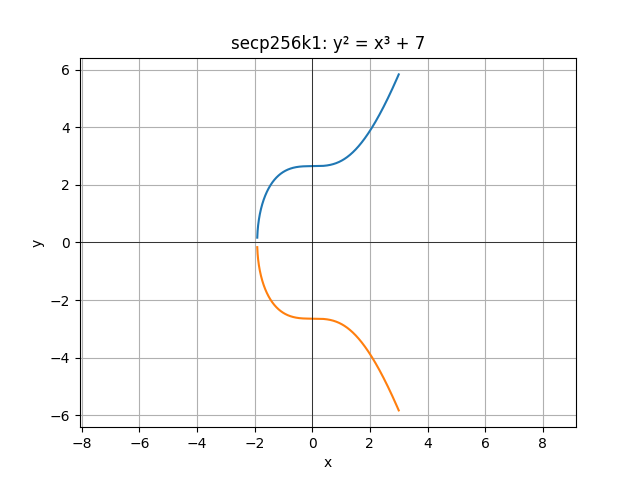

# How Segwit was the last building block to enable the Lightning Network
In January of 2016, the [Lightning Network Paper](https://lightning.network/lightning-network-paper.pdf) was published by Joseph Poon and Thaddeus Dryja.

Later in 2016, Bitcoin core activated BIP112 and BIP68 (OP_CHECKSEQUENCEVERIFY, and the ability to have relative lock times in utxo spending conditions). This allowed Lightning to have a more precise system for timelocks on revocation transactions, allowing them to have a delay relative to the moment the transaction was published onchain, to better control the time to push penalty transactions).

Every light seemed to be green for the actual implementation of Lightning Network. 
Everything except the transaction malleability issue.

## What is the transaction malleability issue?
Let's first understand some fundamentals
### How is the txid of a transaction determined
To make it simple, the txid (transaction identifier) is the hash of all the transaction's data.
All data in the transaction, meaning even signatures that allow to spend the inputs, are serialized and taken into account for the transaction identifier.

We take all fields from the transaction (version, inputs, outputs,...), serialize them as a byte array, and perform a SHA256 hash of the data twice. The result is a 256-bit/32-byte value, which, printed as a hex string of 64 characters, will be used as the txid.

### How transactions signatures work (before SegWit)
I will not fully explain how signing transactions work here, but the properties that help uderstand the problem.

**secp256k1**

Bitcoin signatures are using secp256k1 Elliptic curve. This curve has the formula:
$y^2=x^3+ax+b$

*G* is a point on the curve such as, when we multiply a secret/private key number by *G*, we obtain a point on the curve that is the associated public key.

We can see that the curve is symetric along Y axis, so any X coordinate that is on the curve has up to 2 possible Y value (no Y value if no point of the curve can have that X, 1 possible Y for the X value of the the point where Y is 0, 2 Y coordinates for all other points).

**ECDSA**

Using ECDSA, a signature of a message basically consists in 2 integers r and s, noted (r,s).

For ECDSA (on secp256k1), it can be proven that, if (r,s) is a valid signature, then (r, -s mod n) is also a valid signature (n is the scep256k1 curve order value).

Details, if you feel mathsy:
- For and ECDSA signature, a random number *k* is selected
- *R* is a point on the Elliptic curve, calculated as *R = k * G*
- *r* is derived from the X coordinate value of the point *R* on the curve
- *s* is calculated from a formula that depends on *k*, *r*, *z* (hash of the transaction data), and *d* (the signer's private key):
  $s = k^{-1}\cdot(z + r \cdot sk) \mod n$
- Knowing *r* from the transaction's signature value, we can determine the possible *R* points (at most 2 points on the elliptic curve with that X).
- We can then name the symetric point of *R* on the curve (same X, but opposite Y value) *-R*
- *-R* corresponds to using *-k*, not *k*
- This gives a new valid signature, where the new *s'* value will be *n - $s_0$*

### The problem
As you probably know, noone can sign a transaction for someone else without knowing their private key. But, as we just saw, they can take any signed transaction in the mempool, and have an easy way to calculate another valid transaction from it:

No one can create a valid signature for spending some one else's utxos. But as we just saw, in ECDSA, there is a way to modify a valid sig of an existing transaction without knowing the private key:

- If they take a published transaction, it is easy to extract (r,s) from the signature field of the transaction. 
- they can as easily compute (r, n-s), which will be another valid signature for the same message.
- Then reconstruct a full transaction from it.
- As the txid depends on all transaction data (including the new signature value), the txid for this transaction now has a different value
- They can now publish another transaction, with another txid, that spends the same existing utxos to the same destination adresses.

### Real life consequences
One could think : what is the problem? Bitcoin solves the double spend problem, so only one of the transactions can end up in the mempool. The the wanted inputs will eventually be spent, to the wanted outputs, regardless of which transaction is confirmed.

The simplest example to understand is some retail service that sells something for bitcoin. They will tell the buyer to pay them to some bitcoin address. The buyer will send the seller the transaction id to monitor the success of the payment. They agree that it is considered paid when that transaction has N confirmations.

Imagine the buyer, as soon as he sees that transaction, actually publishes the 'malleated' transaction equivalent, and tries to make it confirmed first (for example by also publishing a transaction that uses the utxo going to them own with a high fee).
The wrong transaction will get confirmed first. The buyer might only notice that his transaction failed, but not notice that some other transaction still sent his satoshis to the sender address. At that point, they might not even have a possibility to see the original transaction data since it was removed as invalid from mempools. the seller can now say : your payment did not work, send it again. And get paid twice!
Of course, an **honest** service provider would not, in principle, want to tarnish his reputation.

But it can also be done in reverse, if some service offers withdrawals. The recipient gives a destination address. The service sends them the pending txid of the withdrawal transaction. The recipient malleates the transaction and makes it confirmed first. They will receive the funds, but the service will thing the withdrawl fail and issue another transaction. The recipient has now been paid twice!
That's part of what happened during the Mt Gox attack.

### For the Lightning Network
For the Lightning Network, this becomes a big problem : channels rely on a funding transaction id : the multisig transaction between the 2 peers that cooperate to create that channel.
Lightning relies on the fact that, at any point from the channel opening confirmation, both peers can unilaterally close the channel, because for each state update of the channel, they atomically exchanged closing transactions (that spend the funding txid), that would give each peer their share of the value they have in the channel.
Now, if someone just malleates the funding transaction, this transaction might get confirmed, and the LN nodes lose track of the channel and both peers can't recover the funds.
To do so, they have to the manage to collaborate to manually re-craft a closing transaction with their two signatures, in a way noone can cheat in the exchange process. And, the whole point of Lightning's trustless construction is that either party should be able to enforce the latest state unilaterally.

## How SegWit fixes this
We saw that the malleability issue comes from the dissimetry of serialized data used for the signature, and for the transaction ID. 
- The signature cannot by definition depend on the value of the signature (itself). But the txid does, since it includes all transaction data. - We can easily find another signature for an already signed transaction
-> transaction can be malleated.

Here comes segwit (Segregated Witness)

One of the points of SegWit is that signatures are needed to validate transactions, but do not really need to be in the UTXO set for later operations.
Before segwit, about 60% of the blockchain data consisted of signatures!
With SegWit, signature stuff is now moved into a new block of data called **witness data**, that some nodes can just ignore for storing/downloading of blocks.

Because SegWit was a soft fork, this new data area is after the legacy transaction data, and will only be transmitted to nodes with SegWit enabled.

Segwit also defines a new consensus on serialization of segwit transaction to define the txid : it takes all previous data areas, and NOT the new withess area, for txid calculation.

So now the transaction id does not depend anymore on the transaction's signatures, and this kind of transaction malleability attack can't work anymore (as long as the output being spent is a Segwit one and not a legacy one)!

I say **this kind** of transactin malleability, because there are other ways transaction can be malleated, for example in multisig transactions construction. But that's a story for another time...

